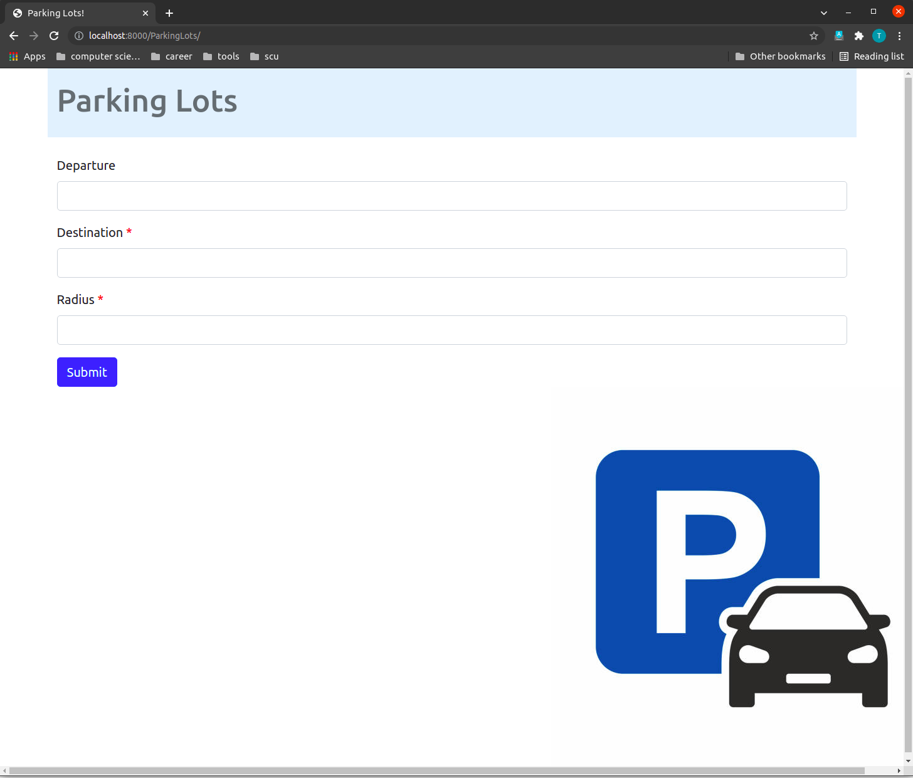

# inrix_hack

## Introduction

This is a project for INRIX HACKATHON. Please check the full story [here](https://devpost.com/software/parkingops-5ewoq7).

## Usage

This is Python Django project. You can use the following command to run the server:

```
python manager.py runserver
```

Once the server is on, go to your browser and enter the url: `localhost:8000/ParkingLots`, then you can see the main page similar to this:



Give the server your destination and radius, then click `submit` button, a map of nearby parking lots will show up. 